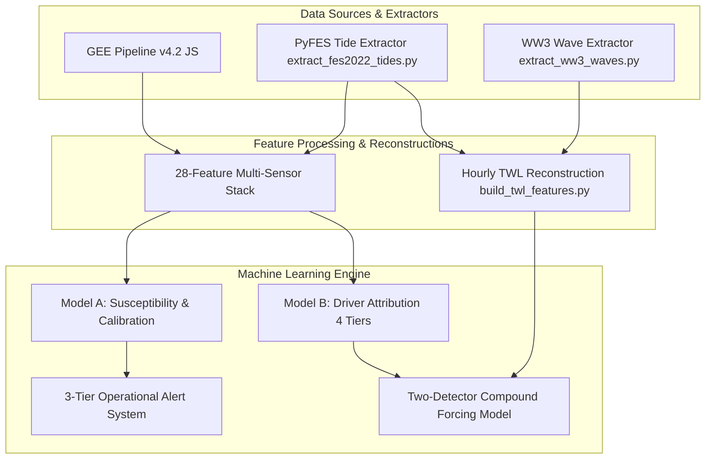

# Keta Intelligence System: Cloud-Based Compound Coastal Flood Prediction & Driver Attribution

[](LICENSE)
[](https://www.python.org/)
[](https://earthengine.google.com/)
[](https://www.aviso.altimetry.fr/)

> **A zero-ground-infrastructure geospatial machine learning framework for compound coastal flood susceptibility mapping, hydro-meteorological driver attribution, wave-tide runup reconstruction, and calibrated early warning on data-sparse barrier coasts.**

---

## 📌 Repository Description (For GitHub About Section)

```text
Cloud-based compound coastal flood prediction and driver attribution framework for data-scarce barrier coasts (Keta, Ghana). Fuses Sentinel-1 SAR, FES2022 tides, WaveWatch III, GPM IMERG, CHIRPS, SMAP L4, and ERA5 with leakage-audited XGBoost models and calibrated alert thresholds.
```

---

## 🌊 Overview

Low-lying barrier coasts along the Gulf of Guinea, such as the **Keta barrier in southeastern Ghana**, experience recurring compound flooding driven by spring tides, swell-driven coastal surges, intense tropical rainfall, and Volta River dam releases (Akosombo Dam). In the absence of local tide gauges and telemetry-equipped weather stations, operational early warning requires cloud-accessible Earth Observation (EO) and global reanalysis data.

The **Keta Intelligence System** integrates **Google Earth Engine (GEE)** multi-sensor satellite imagery, **PyFES FES2022 tidal hydrodynamics**, **NOAA WaveWatch III swell forcing**, and **leakage-audited XGBoost machine learning classifiers**. The system achieves out-of-time flood susceptibility predictions with 80.9% accuracy and provides probabilistic driver attribution (rain-dominant vs. coastal-dominant vs. compound) supported by hourly Total Water Level (TWL) forensic reconstructions.

---

## ✨ Key Features

- **Multi-Sensor Satellite Fusion (GEE Pipeline v4.2)**: Fuses Sentinel-1 SAR change detection (VH polarization, Otsu thresholding), GPM IMERG V07 rain rates, CHIRPS antecedent rainfall, ECMWF ERA5 meteorology, NASA SMAP L4 surface soil moisture, and NASADEM/SRTM topography at 30 m resolution.
- **Hydrodynamic & Wave Forcing**: Computes geocentric tide elevations using FES2022 constituent grids (`PyFES`) and extracts deep-water swell parameters ($H_s, T_p$) from NOAA WaveWatch III (WW3).
- **Hourly Total Water Level (TWL) Reconstruction**: Reconstructs wave-tide phase alignment ($\text{TWL} = \eta_{\text{tide}} + R_{2\%}$) using Stockdon et al. (2006) dissipative wave runup, uniquely identifying peak disaster dates (e.g., Nov 2021 surge with phase alignment index = $1.000$).
- **Leakage-Audited Driver Attribution**: Evaluates pixel-scale attribution (Model B) across four nested feature tiers to prevent label circularity. Demonstrates that leak-free attribution operates via **hydrometeorological elimination** (identifying coastal surges by the absence of sufficient rainfall forcing).
- **Two-Detector Compound Regime Diagnosis**: Classifies compound events where dual forcing occurs simultaneously (e.g., Oct 2023 dam spillage, Jun 2019/2021/2022 events).
- **Calibrated Operational Alert Tiers**: Applies isotonic calibration and Platt scaling to Model A susceptibility predictions, achieving a **Brier Skill Score of 0.33** and defining validated operational alert operating points:
  - 🟢 **Advisory ($P \ge 0.20$)**: 95% flood recall (flags 37% area)
  - 🟡 **Watch ($P \ge 0.30$)**: 78% flood recall (flags 30% area)
  - 🔴 **Warning ($P \ge 0.45$)**: 39% flood recall (flags 15% area)

---

## 📐 System Architecture



---

## 📂 Repository Directory Structure

```text
├── keta_flood_pipeline_v4_2.js          # Production GEE JavaScript pipeline (v4.2)
├── extract_fes2022_tides.py             # PyFES FES2022 tide elevation extractor
├── extract_ww3_waves.py                 # NOAA WaveWatch III wave parameter extractor
├── build_twl_features.py                # Hourly Total Water Level (TWL) & Stockdon runup generator
├── keta_xgboost_v4_2_eval.py            # Model A & Model B XGBoost evaluation & leakage audit
├── keta_event_attribution_v4_2.py       # Event-scale LOOCV driver attribution & P(coastal)
├── keta_wave_compound_v4_2.py           # Two-detector compound flood regime classifier
├── keta_modelA_calibration.py           # Isotonic & Platt probability calibration & alert tiers
├── keta_twl_analysis.py                 # Forensic TWL timeseries analyzer
├── plot_twl_series.py                   # Plotting script for publication TWL figures
├── keta_study_area_map.py               # Study area domain map renderer
├── keta_manuscript_v4_2_draft.md        # Full academic paper draft (v4.2 manuscript)
├── keta_manuscript_v4_2.docx            # Compiled Word manuscript document
├── keta_samples_v4_2_all_splits.csv     # Model A pixel samples (28 features, 23 events)
├── keta_samples_driver_v4_2_all_splits.csv # Model B driver samples (21 dynamic features)
├── fes2022_extracted_tides.csv          # FES2022 tide metrics across all 23 event windows
├── twl_features.csv                     # Extracted TWL features per event
└── README.md                            # Repository documentation
```

---

## 📊 Event Catalogue Summary

The model is trained and evaluated across **23 historical & contemporary flood events (2019–2026)** verified against Ghanaian news reports, NADMO disaster logs, and IOM DTM displacement assessments:

- **Training Split (10 events, 2019–2022)**: Historical baseline events (including Nov 2021 surge and Apr 2022 Agavedzi/Salakope surge).
- **Test Split (4 events, 2023)**: Out-of-time temporal holdout (Jun, Jul, Sep, Oct 2023 Akosombo dam spillage).
- **Validation Split (9 events, 2024–2026)**: Strict multi-year validation holdout (Feb 2024, Jan/Feb/Mar/May 2025 tidal surges, Sep 2025 market flood, Jun 2025 Lawoshime island flood, May/Jun 2026 events).

---

## ⚡ Quickstart & Installation

### 1. Requirements & Setup

Ensure you have Python 3.10+ installed. Clone the repository and install dependencies:

```bash
git clone https://github.com/your-username/keta-flood-intelligence.git
cd keta-flood-intelligence
pip install numpy pandas xgboost scikit-learn matplotlib seaborn pyfes
```

### 2. Extract FES2022 Tides & Wave Parameters

```bash
# Extract FES2022 tides at Keta (0.97°E, 5.90°N)
python extract_fes2022_tides.py

# Extract WaveWatch III wave data & compute TWL features
python extract_ww3_waves.py
python build_twl_features.py
```

### 3. Train & Evaluate XGBoost Models

```bash
# Evaluate Model A (Susceptibility) & Model B (Leakage-Audited Driver Tiers)
python keta_xgboost_v4_2_eval.py

# Run Event-Scale LOOCV Driver Attribution
python keta_event_attribution_v4_2.py

# Perform Probability Calibration & Generate Alert Operating Points
python keta_modelA_calibration.py
```

---

## 📜 Citation & Manuscript

If you use this repository or methodology in your research, please cite the manuscript:

```bibtex
@article{keta_flood_2026,
  title={Compound coastal flood prediction and driver attribution from multi-source Earth observation: a leakage-audited machine learning framework for data-scarce West African coasts applied to Keta, Ghana},
  author={[Your Name]},
  journal={Draft Manuscript v4.2},
  year={2026}
}
```

---

## 🛡️ License

Distributed under the MIT License. See `LICENSE` for more information.
