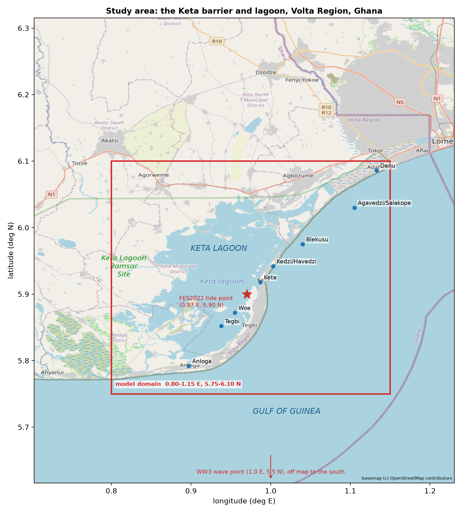
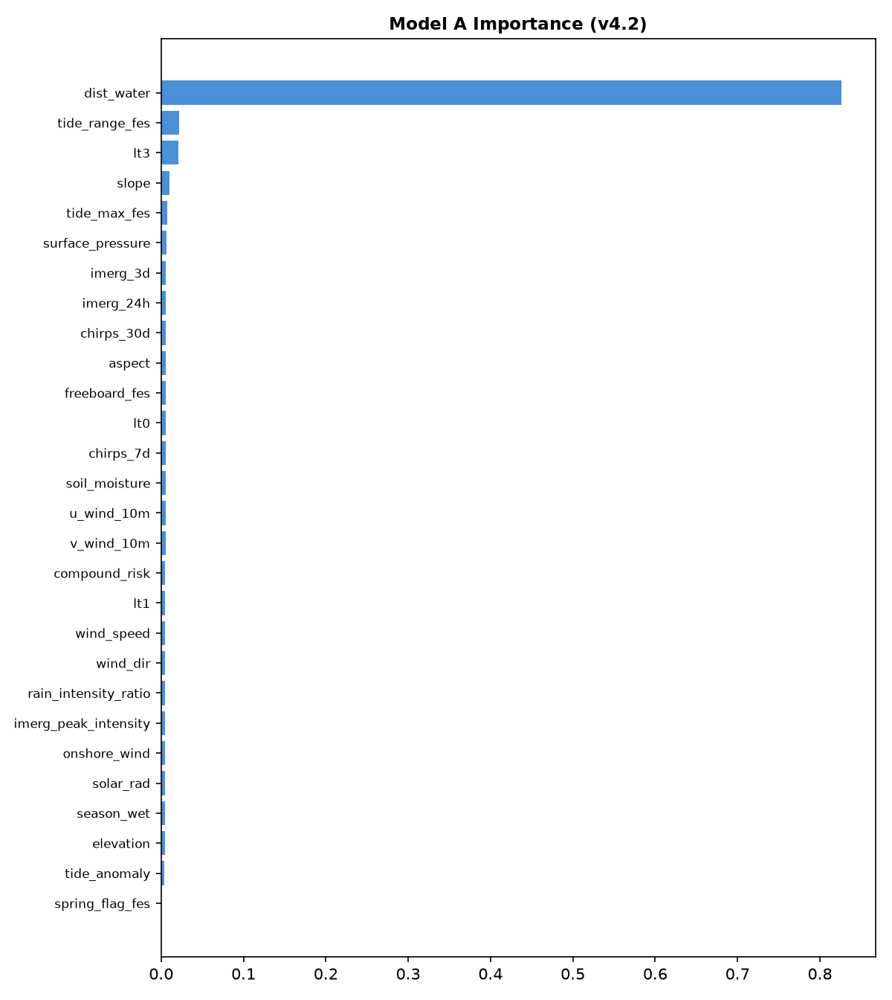
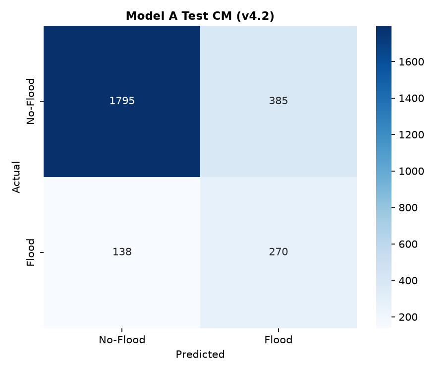
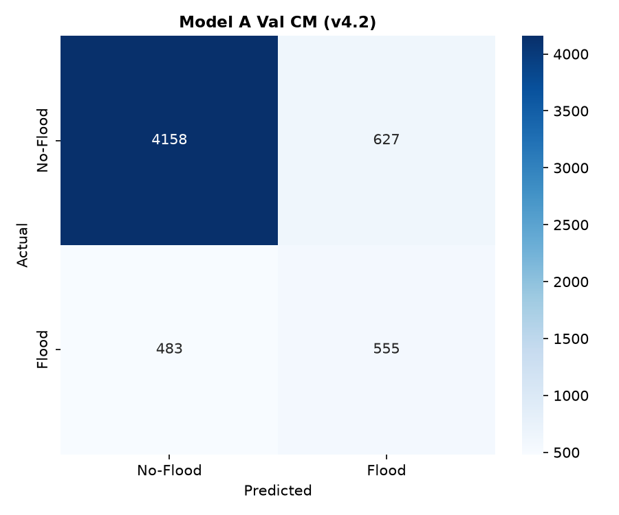
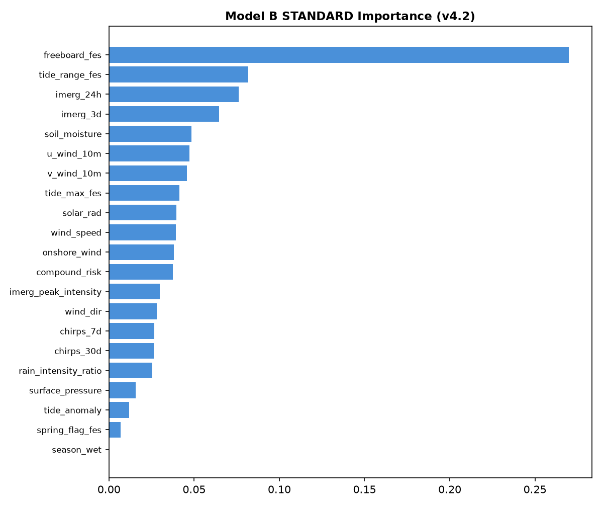
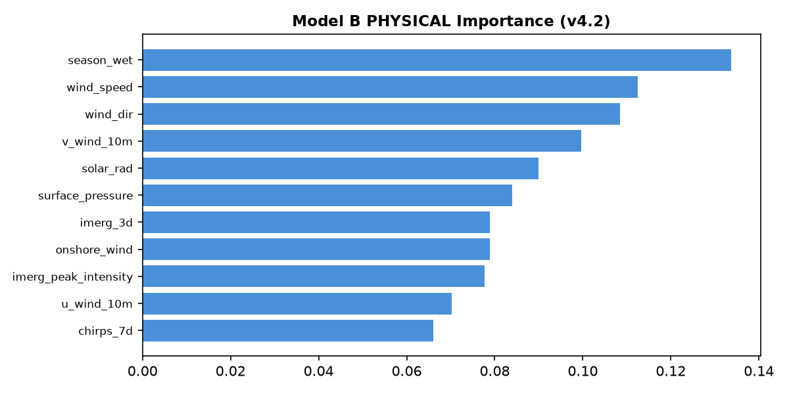
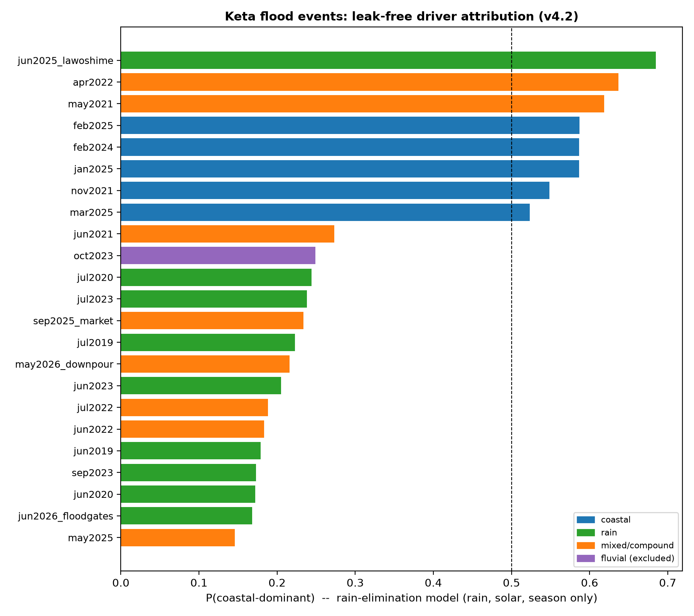
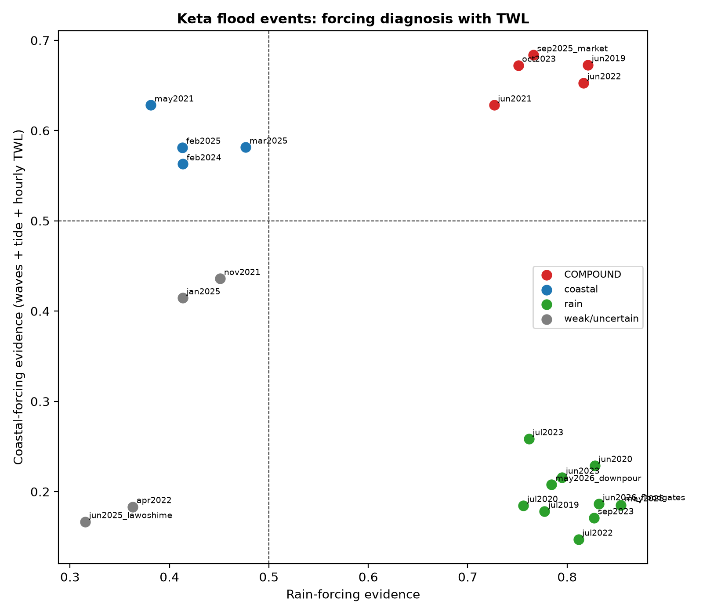
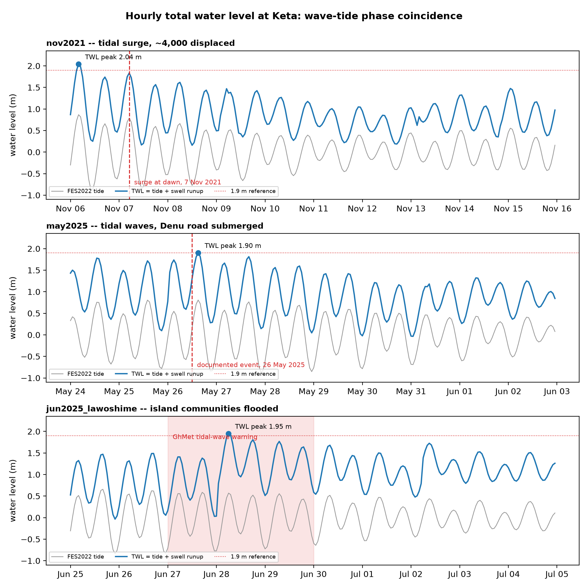
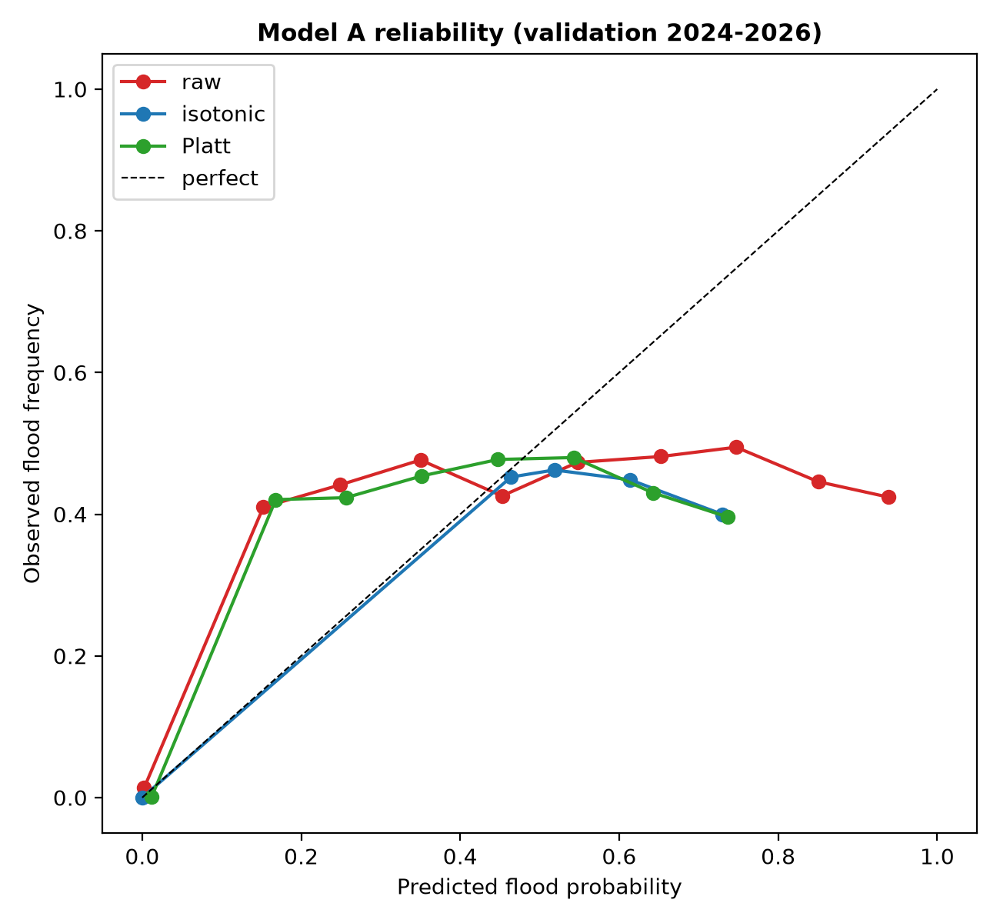

# Compound coastal flood prediction and driver attribution from multi-source Earth observation: a leakage-audited machine learning framework for data-scarce West African coasts applied to Keta, Ghana

**Author:** [Your Name]
**Affiliation:** Independent Researcher, [Your City/Country]
**Date:** July 2026

---

## Abstract

Communities on the low-lying Keta barrier in southeastern Ghana face recurring floods driven by spring tides, swell-driven coastal surges, intense rainfall, and dam releases. Operational early warning is constrained by the absence of local tide gauges and meteorological stations. We present a cloud-based flood prediction and driver-attribution framework that requires no ground infrastructure. The system fuses Sentinel-1 SAR, the FES2022 global tide model, GPM IMERG and CHIRPS precipitation, SMAP L4 soil moisture, ERA5 atmospheric reanalysis, and SRTM topography over a catalogue of 23 flood events (2019-2026) whose dates were verified against news reports and disaster-agency records. Flood labels are derived at 30 m by Otsu thresholding of SAR change images; a per-event audit confirms complete coverage of all events in all six data sources. An XGBoost susceptibility model achieves 79.8% accuracy (Cohen's kappa 0.39) on a 2023 temporal holdout and 80.9% (kappa 0.38) on 2024-2026 validation events, with no degradation over the five-year span. A companion driver-attribution model separates rain-dominant from coastal-dominant flooding and is evaluated under a four-tier leakage audit that progressively removes every feature used in label construction. Attribution skill survives the audit (validation kappa 0.28-0.30 at pixel scale; kappa 0.85, 95% CI spanning 0.69-0.99 accuracy, across 14 decisively labelled events). A mechanism ablation shows that the leak-free skill rests on rainfall observations rather than on local surge proxies: ERA5 pressure and wind carry no attribution signal (kappa -0.02), consistent with Keta's surges originating in remotely generated South Atlantic swell. Leak-free attribution therefore operates by hydrometeorological elimination, identifying coastal floods by the absence of sufficient rainfall forcing. Adding WaveWatch III wave hindcast data confirms why: offshore wave height anti-correlates with coastal disasters at Keta because the South Atlantic swell background peaks in the rainy season, so damaging events arise from moderate swell coinciding with spring tides rather than from extreme offshore seas. An hourly total-water-level reconstruction (FES2022 tide plus swell runup) supplies the corresponding forensic evidence: the November 2021 disaster is the only event in the record with perfect wave-tide phase alignment, and the May 2025 event's water-level peak falls on its documented date. A two-detector framework (independent rain-forcing and coastal-forcing evidence scores) recovers the compound events, coinciding closely with the events whose pixel labels are ambiguous. Isotonic calibration raises probabilistic skill to a Brier skill score of 0.33 over climatology, and Platt scaling yields graded alert tiers (advisory, watch, warning) with quantified recall. The framework uses only global, cloud-accessible data and is transferable to other data-sparse barrier coasts on the Gulf of Guinea.

**Keywords:** compound flooding; XGBoost; Sentinel-1 SAR; FES2022; Google Earth Engine; driver attribution; West Africa

---

## 1. Introduction

Coastal barrier systems support dense settlement and critical infrastructure while remaining exposed to compound flooding, in which oceanographic and meteorological drivers combine to produce impacts that no single driver would cause alone. On West Africa's Gulf of Guinea coast, low-lying barrier lagoons experience flooding from storm surges and spring tides in combination with intense tropical rainfall and, in the Volta delta, controlled dam releases.

Conventional hydrodynamic models (HEC-RAS, MIKE, Delft3D) require local calibration data that this coastline does not have: operational tide gauges are absent outside major ports, and meteorological stations are sparse with frequent telemetry gaps. Satellite observation and global reanalysis offer an alternative, but optical sensors fail during the cloud-covered monsoon season, precisely when floods occur. C-band Synthetic Aperture Radar penetrates cloud and rain, providing usable observations during active flood stages.

Machine learning has been applied widely to flood susceptibility mapping, but three gaps persist. First, few studies integrate ocean-tide boundary conditions, atmospheric fields, and soil moisture in a single compound-risk model. Second, model skill is usually reported under random cross-validation, which spatial and temporal autocorrelation inflate; strict out-of-time evaluation is rare. Third, and most seriously for driver attribution, when labels are constructed from rules applied to the same variables used as features, reported attribution skill can be circular. Attribution claims are rarely audited for this label leakage.

This study addresses these gaps with a fully cloud-based framework applied to the Keta barrier in Ghana. The objectives are to:

1. Build an automated SAR change-detection pipeline (Otsu thresholding, contamination-aware baselines) that extracts historical flood extents for a 23-event catalogue whose dates are verified against documentary records.
2. Integrate FES2022 tidal predictions, computed over windows identical to the event catalogue, as boundary-condition features.
3. Train and evaluate an XGBoost susceptibility model under a strict multi-year temporal holdout (train 2019-2022, test 2023, validate 2024-2026).
4. Evaluate driver attribution under a four-tier leakage audit and a mechanism ablation that together quantify how much attribution skill is genuine and where it comes from.
5. Deliver a zero-infrastructure, transferable framework usable by disaster management authorities such as NADMO.

## 2. Study area

The Keta barrier is a narrow, low-lying sandy strip in the Volta Region of southeastern Ghana, separating the Keta Lagoon from the Gulf of Guinea (5.90 N, 0.97 E). It extends roughly 40 km, with widths from under 100 m to 2.5 km and typical elevations of 1-3 m above mean sea level.

**Figure 1.** The study area: the Keta barrier and lagoon system, Volta Region, Ghana. The red rectangle is the model domain (0.80-1.15 E, 5.75-6.10 N); blue markers are the settlements referenced in the event catalogue (locations approximate); the star is the FES2022 tide extraction point. The WaveWatch III wave extraction point (1.0 E, 5.5 N) lies offshore, south of the map. Basemap (c) OpenStreetMap contributors.

The climate is bimodal tropical wet, with major rains April-June and minor rains September-November. The coast is micro-tidal (spring range roughly 1.3-1.8 m in FES2022) and semi-diurnal. Documented coastal damage at Keta is dominated by long-period swell arriving from distant South Atlantic storms rather than by locally generated wind seas, a point the attribution results return to (Section 4.6).

Despite the Keta Sea Defence Works completed in the early 2000s, communities including Blekusu, Kedzi, Vodza, and the Agavedzi-Salakope stretch continue to flood. Events are compound: during spring tides, waves overtop the beach ridge while heavy rain and lagoon inflows raise the Keta Lagoon, so barrier populations are squeezed between two rising water bodies. The October 2023 Akosombo dam spillage added a third, fluvial pathway.

## 3. Data and methodology

### 3.1 Event catalogue and verification

A catalogue of 23 flood events (2019-2026) was compiled from NADMO reports, IOM displacement assessments, and Ghanaian news coverage. Event windows were cross-checked against these sources, which led to correction of five windows before any model training (Section 4.1). Events were partitioned chronologically:

- Training: 10 events, June 2019 to July 2022.
- Test: 4 events, June 2023 to October 2023.
- Validation: 9 events, February 2024 to June 2026.

Pre-event SAR baselines use a 12-day lookback. Where a lookback would fall within 14 days of a prior catalogued flood, the baseline window slides backward until it clears the prior event, preventing contaminated baselines. A per-event coverage audit counts available images in every source (Sentinel-1 baseline and during-event, IMERG, CHIRPS, ERA5, SMAP) so that missing data cannot silently enter training as fallback constants; two windows were extended by five days on this basis (Section 4.1).

### 3.2 Flood label generation (Sentinel-1 SAR)

Labels use Sentinel-1 GRD VH backscatter, filtered to incidence angles of 30-45 degrees. For each event, a during-flood image I_during is the median of acquisitions in the event window and a baseline I_before is the median over the (contamination-corrected) lookback. The difference image is

I_diff = I_during - I_before.

Flooded pixels are separated by Otsu's method (Otsu, 1979), which selects the threshold t maximizing the between-class variance

sigma_B^2(t) = omega_0(t) * omega_1(t) * [mu_0(t) - mu_1(t)]^2,

where omega_i and mu_i are class probabilities and means. Permanent water is masked with the JRC Global Surface Water occurrence layer (> 80%). Labels are therefore proxies for temporary inundation, not surveyed flood extents.

### 3.3 Predictor variables (28 features)

The feature stack contains 28 bands:

1. Topography (7): NASADEM elevation, slope, aspect, distance to permanent water, and binary masks at < 3 m, < 1 m, < 0 m.
2. Precipitation (5): IMERG maximum 24-h rainfall in the window, IMERG peak half-hourly intensity, IMERG accumulation, and CHIRPS 7-day and 30-day antecedent totals.
3. Atmosphere (7): ERA5 solar radiation, u- and v-wind at 10 m, wind speed, wind direction, surface pressure (inverse-barometer proxy), and an onshore wind component projected on the shore-normal of Keta's 135-degree coastline orientation.
4. Soil moisture (1): SMAP L4 surface soil moisture (sm_surface, volumetric), 5-day mean.
5. Tides (4): FES2022 maximum geocentric tide, tidal range, spring flag (range at or above the 23-event median of 1.57 m), and tide anomaly (maximum minus the 0.75 m baseline).
6. Derived (4): freeboard (tide maximum minus elevation), a compound-risk index (product of normalized 24-h rain, soil moisture, and tidal range), a wet-season flag (April-June, September-November), and a rain-intensity ratio (IMERG peak over 30-day CHIRPS).

The susceptibility model (Model A) uses all 28 features. The driver model (Model B) uses the 21 dynamic features, excluding all seven terrain bands so that attribution cannot be memorized from geography. One caveat is stated here and handled by the leakage tiers: freeboard embeds elevation, so the dynamic set is not fully terrain-free until freeboard is removed in the stricter tiers.

### 3.4 FES2022 tidal boundary conditions

With no tide gauge at Keta, astronomical tides were computed from FES2022 constituent grids (ocean plus load tide, giving geocentric tide) at hourly resolution for the point 0.97 E, 5.90 N, using windows identical to the event catalogue. The spring flag threshold is the median tidal range across the 23 events. Tidal quantities enter the model as event-constant bands.

### 3.5 Sampling

Each event's feature stack was sampled at 30 m resolution (650 requested pixels per event, fixed seed), yielding 14,881 samples: 12,095 non-flood and 2,786 flood, of which 1,359 are rain-labelled and 1,427 coastal-labelled. Class imbalance was handled with inverse-frequency sample weights during training; no synthetic oversampling was used, and test and validation sets remain in their native distributions.

### 3.6 Driver labels

Among flooded pixels, a Rainfall Flooding Index (RFI, a weighted sum of percentile-normalized 24-h rain, 30-day antecedent rain, and soil moisture) is compared with a Coastal Inundation Index (CII, a weighted sum of normalized freeboard and tidal range). Pixels with RFI >= CII are labelled rain-dominant, otherwise coastal-dominant. Because these labels are rule-based rather than observed, all attribution results are subjected to the leakage audit of Section 3.8.

### 3.7 Classifiers

Gradient-boosted tree ensembles (XGBoost; Chen and Guestrin, 2016) were used throughout: 300 trees, maximum depth 6, learning rate 0.1, feature and row subsampling 0.8, fixed seed. Event-level models (Section 3.8) use a smaller, more regularized configuration (100 trees, depth 3, L1 = 1.0, L2 = 2.0) with feature standardization, appropriate to the small sample.

### 3.8 Leakage audit and mechanism ablation

Model B is evaluated at four nested feature tiers: standard (all 21 dynamic features), no-leak (removing the two direct rule variables, 24-h rain and freeboard), strict (removing all six variables that enter the RFI/CII formulas), and physical-only (additionally removing every tide-table quantity and the rain-intensity ratio, leaving 11 independently measured meteorological features).

For event-scale analysis, flooded-pixel features are aggregated per event (mean, maximum, standard deviation) and a hard label is assigned only when the pixel majority is decisive (>= 0.60); less decisive events are classed mixed/compound, and the October 2023 dam-spillage event is excluded as fluvial. Classification uses leave-one-out cross-validation with Wilson 95% confidence intervals. A mechanism ablation contrasts a surge-proxy feature set (pressure and wind only) with a rainfall-only set to locate the source of attribution skill. A rainfall-only model finally produces a soft coastal probability P(coastal) for all 23 events.

### 3.9 Wave forcing, total water level, and probability calibration

Wave conditions were taken from the NOAA WaveWatch III global hindcast (0.5 degrees, 3-hourly, 2017 to present; Tolman, 2009), extracted at an offshore point (5.5 N, 1.0 E) for windows identical to the catalogue: significant wave height, swell-partition height, and swell peak period, with a deep-water wave-power proxy 0.49 H_s^2 T_p.

Because window statistics cannot distinguish "high tide and high swell somewhere in the window" from "high swell arriving on high tide", an hourly total water level was reconstructed for every event:

TWL(t) = tide(t) + R2(t),  R2(t) = 0.043 sqrt(H0(t) L0(t)),  L0 = g T^2 / (2 pi),

where tide(t) is the hourly FES2022 geocentric tide and R2 is the dissipative-beach 2% runup term of Stockdon et al. (2006). With no surveyed beach profile the constant is shared across events, so TWL is a relative measure of wave-tide phase coincidence. Event features are the window maximum and 95th percentile of TWL, hours above 1.9 m, and a phase-alignment index defined as the TWL maximum divided by the sum of the separate tide and runup maxima (1.0 when the swell peak arrives exactly on the tide peak).

Compound events were addressed with a two-detector framework: a rain-forcing evidence score from the rainfall-only model and a coastal-forcing evidence score from a wave-plus-tide model, each trained on the decisively labelled events with leave-one-out probabilities. An event with both evidences above 0.5 is diagnosed compound.

Model A probabilities were calibrated on out-of-fold training predictions (5-fold cross-validation) with two mappings: isotonic regression (best probability values) and Platt scaling (a smooth monotone mapping suitable for graded alert thresholds). Both were applied unchanged to the untouched test and validation splits and scored with the Brier score against a climatological reference.

## 4. Results

### 4.1 Catalogue verification and data integrity

Cross-referencing the catalogue against documentary sources corrected five event windows before training. The most consequential was the November 2021 disaster (about 4,000 displaced): the original window (10-20 November) began three days after the surge, which struck at dawn on 7 November 2021. The April 2022 Agavedzi-Salakope event had been misdated to May 2022; the January and February 2025 events had windows starting after their documented onsets (16 January and 1 February); and one event assigned to May 2024, for which no documentary evidence exists, was re-assigned to the documented event of 26 May 2025. Regenerating FES2022 tides over corrected windows changed the tidal maximum, range, or spring classification for 10 of 23 events. The corrected catalogue is physically coherent: every documented tidal-wave event falls on spring tides (maximum geocentric tide 0.81-0.91 m), while rain and dam-spillage events fall on neaps (0.55-0.74 m).

The coverage audit exposed two further defects. The soil-moisture source used in earlier pipeline versions (NASA-USDA SMAP) was discontinued in August 2022, so the 11 most recent events had been receiving a constant fallback value; it was replaced with SMAP L4. Two validation events (February 2024, March 2025) contained no Sentinel-1 acquisition in their windows, which would have produced spurious all-negative labels; both windows were extended by five days to capture the next orbital pass. After correction, all 23 events have complete coverage in all six sources.

The corrected driver labels agree with the documented character of events: the 2024-2025 tidal surges of February 2024, February 2025, and March 2025 yield 100% coastal-labelled flood pixels, November 2021 yields 69%, and the September 2023 event (rainfall plus dam-spillage onset) yields 99% rain-labelled pixels.

**Table 1.** FES2022 geocentric tide over the corrected event windows (full 23-row table in the supplementary CSV, fes2022_extracted_tides.csv).

| Event | Window | Max tide (m) | Range (m) | Spring |
|---|---|---|---|---|
| nov2021 | 2021-11-06 to 11-16 | 0.867 | 1.736 | 1 |
| apr2022 | 2022-04-03 to 04-14 | 0.676 | 1.312 | 0 |
| sep2023 | 2023-09-15 to 09-25 | 0.670 | 1.323 | 0 |
| feb2024 | 2024-02-10 to 02-25 | 0.884 | 1.793 | 1 |
| mar2025 | 2025-03-01 to 03-15 | 0.914 | 1.749 | 1 |
| ... | ... | ... | ... | ... |

### 4.2 Flood susceptibility (Model A)

Model A performance was stable across both out-of-time periods (Table 2): 79.8% accuracy (kappa 0.389) on the 2023 test events and 80.9% (kappa 0.383) on the 2024-2026 validation events. The absence of degradation over five years indicates generalization across years rather than memorization of event conditions. Flood-class recall was 0.66 (test) and 0.53 (validation) at precisions of 0.41 and 0.47; the no-flood class exceeds F1 = 0.87 in both periods. Feature importance is dominated by distance to permanent water (gain share 0.83), followed by tidal range, the 3-m elevation mask, and slope, consistent with flood water propagating from the lagoon and shoreline into the lowest terrain (Figure 2).

**Figure 2.** Model A feature importance (XGBoost gain). Distance to permanent water dominates, followed by tidal range, the 3-m elevation mask, and slope.

**Table 2.** Model A confusion matrices on out-of-time splits.

| | Predicted no-flood | Predicted flood | | Accuracy | Kappa |
|---|---|---|---|---|---|
| Test 2023: actual no-flood | 1,795 | 385 | | 79.8% | 0.389 |
| Test 2023: actual flood | 138 | 270 | | | |
| Validation 2024-26: actual no-flood | 4,158 | 627 | | 80.9% | 0.383 |
| Validation 2024-26: actual flood | 483 | 555 | | | |

**Figure 3.** Model A confusion matrices on the out-of-time splits: (a) test events, 2023; (b) validation events, 2024-2026.

### 4.3 Terrain ablation

Removing the three leading static features (slope, aspect, distance to water) reduced kappa from 0.389 to 0.320 (test) and from 0.383 to 0.272 (validation) with little change in overall accuracy. Removing all seven terrain bands gave kappa 0.284 (test) and 0.283 (validation). Terrain is therefore the leading, but not overwhelming, source of spatial skill; part of the residual skill reflects elevation information carried implicitly by the freeboard feature. This is a weaker terrain dependence than reported in an earlier version of this pipeline, whose inputs were later found to contain constant-fallback defects (Section 4.1); we treat the present figures as the reliable estimate.

### 4.4 Pixel-scale driver attribution under leakage control

Table 3 reports Model B at the four leakage tiers. The standard tier reached kappa 0.622 (test) and 0.539 (validation); its importance ranking confirms reliance on rule inputs (freeboard 0.27, tidal range 0.08, 24-h rain 0.08), which is what the stricter tiers are designed to remove (Figure 4). The no-leak and strict tiers retain validation kappa of 0.301 and 0.291. The physical-only tier, with no tide-table information at all, retains kappa 0.275 (validation). All leak-free tiers remain above chance, in contrast to the pre-correction pipeline in which the strict tier collapsed to kappa 0.04. We attribute the recovery mainly to restored soil-moisture variability and corrected tidal boundary conditions.

**Table 3.** Pixel-scale driver attribution (rain- versus coastal-dominant) across leakage tiers.

| Tier | Features | Test acc / kappa | Validation acc / kappa |
|---|---|---|---|
| Standard | 21 | 84.1% / 0.622 | 77.7% / 0.539 |
| No-leak | 19 | 67.7% / 0.165 | 71.3% / 0.301 |
| Strict | 15 | 70.1% / 0.094 | 71.1% / 0.291 |
| Physical-only | 11 | 75.5% / 0.232 | 70.3% / 0.275 |
| Strict, pre-correction pipeline | 11 | 52.6% / 0.04 | - |

**Figure 4.** Model B feature importance at (a) the standard tier, dominated by the label-rule inputs freeboard and tidal range, and (b) the physical-only tier, where the model must rely on independently measured meteorology. This contrast shows the leakage audit visually.

### 4.5 Event-scale attribution and mechanism ablation

The decisive-majority rule (>= 0.60) yields 14 hard-labelled events (9 rain, 5 coastal), eight mixed/compound events, and one excluded fluvial event. Under leave-one-out cross-validation (Table 4), the full feature set reached 85.7% accuracy (kappa 0.689). A stricter majority threshold (0.65, n = 9) leaves too few events for stable estimation and is reported only as a robustness boundary.

The ablation locates the leak-free skill. Local surge proxies alone (ERA5 pressure and wind, including the shore-normal component) show no skill (57.1%, kappa -0.024), missing four of the five coastal events. Rainfall-related features alone (IMERG peak and accumulation, 7-day CHIRPS, solar radiation, season flag) give the best leak-free result of any configuration: 92.9% accuracy (95% CI 69-99%), kappa 0.851, with a single error. Leak-free attribution at Keta therefore works by hydrometeorological elimination: coastal floods are recognized by the absence of rainfall sufficient to explain the observed inundation, not by direct detection of surge conditions. The null result for local surge proxies is physically consistent with the swell origin of Keta's coastal events; long-period swell from distant South Atlantic storms is not expressed in local pressure or wind. The model is not simply reading the season: November 2021 falls in the minor wet season yet is attributed correctly from the measured rainfall amounts. Given n = 14, confidence intervals are wide, and we present the event scale as a consistency check on the statistically firmer pixel-scale result (n = 2,786).

**Table 4.** Event-scale LOOCV attribution on decisively labelled events (n = 14; Wilson 95% CIs).

| Feature set | Accuracy (95% CI) | Kappa | Errors |
|---|---|---|---|
| Rain-only (5) | 92.9% (69-99%) | 0.851 | 1 |
| Full dynamic (21) | 85.7% (60-96%) | 0.689 | 2 |
| Strict (15) / physical (11) | 78.6% (52-92%) | 0.512 | 3 |
| Surge-only (6) | 57.1% (33-79%) | -0.024 | 6 |

### 4.6 Probabilistic attribution and label noise

The rainfall-elimination model produces P(coastal) for all 23 events (Figure 5; LOOCV probabilities for labelled events, out-of-sample prediction otherwise). The five confirmed coastal events form a distinct band (P = 0.52-0.59), separated by an empty margin (0.28-0.52) from the confirmed rain events (P = 0.17-0.24), with one exception (June 2025 Lawoshime, P = 0.685).

**Figure 5.** Soft coastal-attribution probability P(coastal) for all 23 events from the rainfall-elimination model. Colours mark the event category (coastal, rain, mixed/compound, fluvial); the dashed line is P = 0.5.

Four observations bear on the physical validity of these probabilities. The April 2022 event, a documented tidal-wave disaster whose pixel label is nearly ambiguous (55% coastal), receives P = 0.637: the model recovers the documented driver despite the noisy label. May 2021, an unverified event with a 50:50 pixel split, receives P = 0.619, a testable prediction that the event was coastal-driven. The excluded fluvial event (October 2023) receives P = 0.249, correctly rejecting a coastal origin for an event whose rule-based label (61% coastal) is physically implausible. The main failure is informative: the May 2025 tidal-wave event, whose window lies in the wet season, receives P = 0.146. Elimination fails when surge and substantial rainfall coincide, which is exactly the compound regime, and this motivated the wave-forcing analysis of Sections 4.7-4.9.

### 4.7 Wave forcing: the seasonality inversion

Adding WaveWatch III wave features produced a result that reframes surge detection at this site: offshore wave height anti-correlates with coastal flood events. The South Atlantic swell background peaks during the boreal summer rainy season (window-maximum significant wave heights of 2.0-2.4 m for the June-September rain events), while every documented dry-season tidal disaster occurred under lower offshore seas (1.4-1.7 m). A wave-only event classifier consequently reaches kappa 0.851 in LOOCV, but it achieves this by exploiting the seasonal wave climate, the mirror image of rainfall elimination, and not by detecting surges directly. Keta's disasters occur when moderate swell coincides with a spring tide, not when offshore waves are largest.

### 4.8 Compound-event diagnosis with two detectors

The two-detector framework diagnoses five events as compound (both rain-forcing and coastal-forcing evidence above 0.5): October 2023, September 2025, and the June events of 2019, 2021, and 2022. These coincide almost exactly with the events whose pixel-majority labels are ambiguous (majorities of 0.52-0.64), so two independent lines of evidence, dual forcing and label ambiguity, identify the same set. We read this as the mixed pixel labels being informative rather than noisy: those events genuinely carried both forcings (Figure 6). The framework does not resolve May 2025 (rain evidence 0.85, coastal evidence 0.19), which motivates the phase-resolved analysis below.

**Figure 6.** Two-detector forcing diagnosis for all 23 events. The horizontal axis is rain-forcing evidence, the vertical axis coastal-forcing evidence (waves, tide, and TWL features); the upper-right quadrant is diagnosed compound. The compound quadrant is occupied almost exclusively by the events whose pixel-majority labels are ambiguous.

### 4.9 Total water level: forensic evidence at hourly resolution

The hourly TWL reconstruction recovers what window statistics cannot (Figure 7). It yields three findings. First, November 2021, the most severe disaster in the record, is the only event of 23 with perfect phase alignment (index 1.000): the swell peak arrived exactly on the spring-tide peak, producing 2.04 m TWL, the highest dry-season value in the record. Second, the May 2025 event's TWL peak (1.90 m) falls on 26 May, the documented disaster date, from the coincidence of a 0.81 m spring tide with 1.6 m swell. Third, the June 2025 Lawoshime event's TWL peak (27-28 June) falls inside the tidal-wave warning issued by the Ghana Meteorological Agency for 27-30 June 2025, indicating that this event, labelled rain-dominant by the pixel rule, in fact carried a coastal component; this retrospectively explains its persistent misclassification in Sections 4.5-4.6 as probable label error rather than model failure.

**Figure 7.** Hourly total water level (FES2022 tide plus Stockdon swell runup) for three forensically decisive events. Top: November 2021, the only event in the record with perfect wave-tide phase alignment; the TWL crest coincides with the surge that displaced about 4,000 people at dawn on 7 November. Middle: May 2025; the window's single 1.90 m peak falls on the documented disaster date of 26 May. Bottom: June 2025 (Lawoshime); the TWL peak falls inside the Ghana Meteorological Agency tidal-wave warning of 27-30 June (shaded), evidence that this rain-labelled event carried a coastal component.

As classifier inputs, however, the TWL features do not help (TWL-only LOOCV kappa -0.26): at 0.5-degree offshore resolution the seasonal wave climate dominates the absolute TWL, and the dry-season disasters of early 2024-2025 have low offshore values. What made those events destructive evidently lies in nearshore wave transformation and shoreline state below the resolution of global data. TWL is therefore used here as per-event forensic evidence, while classification rests on rainfall elimination.

### 4.10 Probability calibration and alert tiers

Isotonic calibration improved the validation Brier score from 0.122 (raw) to 0.098, against a climatological reference of 0.147, a Brier skill score of 0.33 (test: 0.26) (Figure 8).

**Figure 8.** Reliability diagram for Model A flood probabilities on the validation split (2024-2026): raw model output, isotonic calibration, and Platt scaling against the perfect-reliability diagonal. Platt scaling scores slightly worse on Brier (0.105) but provides the smooth mapping needed for graded thresholds. Operating points on the calibrated validation probabilities support a three-tier scheme (Table 5): an advisory tier at P >= 0.20 flags 37% of the study area and captures 95% of flooded pixels; a watch tier at P >= 0.30 flags 30% at recall 0.78; a warning tier at P >= 0.45 flags 15% at recall 0.39. Precision is nearly constant (0.45-0.47) across thresholds, which we interpret as the noise ceiling of the SAR-derived labels rather than a ranking failure.

**Table 5.** Alert operating points (Platt-calibrated probabilities, validation split).

| Tier | Threshold | Area flagged | Flood recall | Precision |
|---|---|---|---|---|
| Advisory | P >= 0.20 | 37% | 0.95 | 0.46 |
| Watch | P >= 0.30 | 30% | 0.78 | 0.46 |
| Warning | P >= 0.45 | 15% | 0.39 | 0.47 |

## 5. Discussion

### 5.1 Physical drivers

On this low-relief barrier, topography controls where water collects and weather and tides control when flooding occurs. Distance to permanent water dominates susceptibility, and terrain ablation reduces but does not eliminate skill, partly because freeboard carries elevation implicitly. The attribution results add a mechanism-level finding: at this site, the observable that distinguishes coastal from pluvial flooding in leak-free settings is rainfall itself. Local pressure and wind carry no surge signal, because the damaging surges are generated by distant Southern Hemisphere storms and arrive as long-period swell.

The wave analysis sharpened this into a seasonality inversion: offshore wave energy is highest in the rainy season, so coastal disasters at Keta are coincidence events, with moderate swell arriving on a spring tide, rather than extreme-sea events. The hourly TWL reconstruction demonstrates the mechanism directly for the two most instructive cases (November 2021 with perfect phase alignment; May 2025 with its TWL peak on the documented disaster date) and exposed one probable label error (June 2025 Lawoshime, whose TWL peak coincides with an official tidal-wave warning). Direct surge classification from global data remains out of reach because the discriminating physics is nearshore: wave transformation over local bathymetry, shoreline erosion state, and defence condition. Progress there requires either a nearshore wave transformation model or in-situ runup observation, and we state this as the framework's physical boundary rather than a solvable data gap.

### 5.2 Credibility of the attribution claim

Because driver labels are rule-based, attribution skill must be audited for circularity. The four-tier audit quantifies it: operational skill (kappa 0.54-0.62) exceeds leak-free skill (kappa 0.28-0.30 at pixel scale), and the difference measures how much the standard model reconstructs its own labelling rule. What remains after the audit is supported by external evidence rather than internal consistency: agreement of labels with documented event character (Section 4.1), recovery of the documented driver for a mislabelled event (April 2022), rejection of a physically implausible label (October 2023), and a falsifiable prediction for an unverified event (May 2021). We suggest this audit-plus-external-evidence pattern as a template for attribution studies that rely on rule-derived labels.

### 5.3 Limitations

1. Labels are SAR change-detection proxies, not surveyed extents, and inherit Sentinel-1 revisit limitations; during the single-satellite period (2022-2024) several events are covered by one acquisition.
2. The catalogue contains 23 events, and only 14 carry decisive driver labels; event-scale confidence intervals are wide.
3. Driver labels are index-based; the leakage audit bounds, but cannot remove, their circularity.
4. Forcing resolution is coarse relative to the 30-m terrain grid (ERA5 about 31 km, SMAP L4 about 9 km), which suppresses fine-scale wind setup and lagoon-margin drainage effects.
5. Elimination-based attribution fails for wet-season compound surges (May 2025), the case of greatest practical concern; the TWL reconstruction times such events correctly but cannot yet classify them, because the discriminating physics is nearshore and below the resolution of global wave data.
6. Precision of the susceptibility model is capped near 0.46 at every threshold, which we attribute to noise in the single-pass SAR labels; multi-pass label compositing is the corresponding future work.
7. Calibrated probabilities transfer a training-period mapping to later years; recalibration against impact observations is advisable before operational deployment, and the alert tiers of Section 5.4 should be treated as validated starting points rather than final settings.

### 5.4 Early warning application

Every input is available in near real time (IMERG late run within hours, ERA5 within days, SMAP L4 within days, WaveWatch III within hours) or in advance (FES2022 tides are deterministic), so the framework can support a diagnostic nowcast. The calibrated operating points of Table 5 give NADMO a defensible three-tier scheme without further tuning: advisory at P >= 0.20 (95% of flooded pixels captured while flagging 37% of the area), watch at 0.30, warning at 0.45, each with known recall so message urgency maps to quantified miss rates. The attribution and compound outputs add response value: a coastal-attributed alert argues for shoreline evacuation and sea-defence response, a rain-attributed alert argues for lagoon-level management including the Havedzi flood-control gate, and a compound diagnosis argues for both simultaneously, the scenario that trapped barrier communities between two rising water bodies in 2021 and 2025. The TWL series additionally offers a forecast pathway: because tides are deterministic and swell forecasts extend 5-7 days, TWL peaks of the November 2021 type are predictable days ahead.

## 6. Conclusions

This study developed and audited a cloud-based compound flood prediction and attribution framework for the Keta barrier using only global datasets. Five findings stand out. First, data integrity dominates model quality in data-sparse settings: correcting five event windows, a discontinued soil-moisture source, and two label-breaking coverage gaps changed headline attribution skill from chance (kappa 0.04) to clearly above chance, and we recommend routine per-event coverage audits and documentary verification of event catalogues. Second, susceptibility prediction generalizes across years (accuracy about 80%, kappa 0.38-0.39 over 2023-2026 holdouts) with topography as the leading but not sole control, and isotonic calibration lifts probabilistic skill to a Brier skill score of 0.33, sufficient for a validated three-tier alert scheme. Third, driver attribution survives a strict leakage audit, and an ablation shows its leak-free mechanism is hydrometeorological elimination based on rainfall observations; local pressure and wind are uninformative because Keta's surges arrive as remotely generated swell. Fourth, wave data confirms the mechanism from the other side: offshore wave energy anti-correlates with coastal disasters because the swell climate peaks in the rainy season, so Keta's coastal floods are coincidence events in which moderate swell meets spring tide, and the hourly total-water-level reconstruction identifies that coincidence directly, uniquely marking the November 2021 disaster (phase alignment 1.000) and timing the May 2025 event to its documented day. Fifth, a two-detector framework gives compound events an operational definition and independently recovers the events whose pixel labels are ambiguous, while also exposing one probable label error through an official tidal-wave warning. The remaining physical boundary is nearshore wave transformation, which global data cannot resolve. All datasets are global and cloud-accessible, and the pipeline transfers to other data-sparse barrier coasts of the Gulf of Guinea.

---

## References

- Chen, T., & Guestrin, C. (2016). XGBoost: A scalable tree boosting system. *Proceedings of the 22nd ACM SIGKDD International Conference on Knowledge Discovery and Data Mining*, 785-794.
- Funk, C., et al. (2015). The climate hazards infrared precipitation with stations: a new environmental record for monitoring extremes. *Scientific Data*, 2, 150066.
- Gorelick, N., Hancher, M., Dixon, M., Ilyushchenko, S., Thau, D., & Moore, R. (2017). Google Earth Engine: Planetary-scale geospatial analysis for everyone. *Remote Sensing of Environment*, 202, 18-27.
- Hersbach, H., et al. (2020). The ERA5 global reanalysis. *Quarterly Journal of the Royal Meteorological Society*, 146(730), 1999-2049.
- Huffman, G. J., et al. (2020). Integrated Multi-satellite Retrievals for the Global Precipitation Measurement (GPM) mission (IMERG). *Advances in Global Change Research*, 67, 343-353.
- Lyard, F., Carrere, L., et al. (2025). FES2022 a step towards a SWOT-compliant tidal correction. [Verify final citation for the FES2022 release paper.]
- Otsu, N. (1979). A threshold selection method from gray-level histograms. *IEEE Transactions on Systems, Man, and Cybernetics*, 9(1), 62-66.
- Reichle, R., et al. (2022). SMAP L4 Global 3-hourly 9 km EASE-Grid Surface and Root Zone Soil Moisture (SPL4SMGP). NASA NSIDC DAAC. [Verify version/DOI.]
- Stockdon, H. F., Holman, R. A., Howd, P. A., & Sallenger, A. H. (2006). Empirical parameterization of setup, swash, and runup. *Coastal Engineering*, 53(7), 573-588.
- Tolman, H. L. (2009). User manual and system documentation of WAVEWATCH III version 3.14. NOAA/NWS/NCEP Technical Note 276. [Data served via the PacIOOS ERDDAP mirror of the NOAA WW3 global hindcast.]
- Twele, A., Cao, W., Plank, S., & Martinis, S. (2016). Sentinel-1-based flood mapping: a fully automated processing chain. *International Journal of Remote Sensing*, 37(13), 2990-3004. [Verify exact title/journal.]

[Add: NADMO and IOM DTM report citations for the event catalogue; Wikipedia:Signs-of-AI-writing is not cited, it informed style only.]
